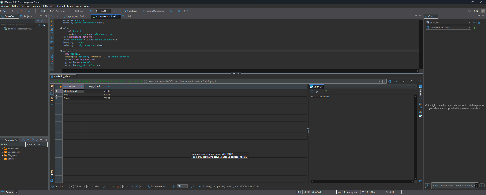

# 📊 Projeto Prático: Análise de Campanhas de Marketing com SQL

Este repositório documenta uma sessão de prática guiada e desenvolvimento prático em **SQL**, utilizando uma base de dados de marketing com mais de **64 mil linhas**. 

O projeto simula um ambiente real de análise de dados, onde desafios de negócio foram propostos passo a passo, estruturados, codificados e validados utilizando **PostgreSQL** e **DBeaver**.

---

## 🎯 Contexto e Metodologia
Nesta jornada prática, o fluxo de trabalho consistiu em:
1. **Definição do Desafio:** Apresentação de perguntas de negócios voltadas para otimização de campanhas comerciais.
2. **Resolução Autônoma:** Construção e refinamento das consultas SQL para responder a cada métrica.
3. **Validação Técnica:** Aplicação de boas práticas de sintaxe, ordenação, funções de agregação, filtros condicionais e manipulação de tipos de dados.

---

## 💻 Consultas e Casos de Negócio Resolvidos

### 1. Qual canal de marketing gerou o maior volume total de conversões?
* **Conceito aplicado:** Agrupamento básico (`GROUP BY`) e ordenação decrescente (`ORDER BY DESC`).

    SELECT 
        md.channel,
        SUM(conversion) AS total_conversoes
    FROM marketing_data md
    GROUP BY md.channel
    ORDER BY total_conversoes DESC;

### 2. Desempenho por canal considerando apenas clientes que usaram BOGO (`used_bogo`)
* **Conceito aplicado:** Filtragem de linhas com `WHERE`.

    SELECT 
        md.channel,
        SUM(conversion) AS total_conversoes
    FROM marketing_data md 
    WHERE used_bogo = 1
    GROUP BY channel
    ORDER BY total_conversoes DESC;

### 3. Campanhas impactadas por duas estratégias simultâneas (BOGO + Desconto)
* **Conceito aplicado:** Múltiplas condições lógicas utilizando o operador `AND`.

    SELECT 
        md.channel,
        SUM(conversion) AS total_conversoes
    FROM marketing_data md 
    WHERE used_bogo = 1 AND used_discount = 1
    GROUP BY channel 
    ORDER BY total_conversoes DESC;

### 4. Qual o histórico médio de compras por canal (com arredondamento)?
* **Conceito aplicado:** Cálculo de média (`AVG`), arredondamento (`ROUND`) e conversão explícita de tipo de dados (`::numeric`).

    SELECT 
        md.channel,
        ROUND(AVG(history)::numeric, 2) AS avg_historico
    FROM marketing_data md
    GROUP BY md.channel
    ORDER BY avg_historico DESC;

  

### 5. Filtrando conversões apenas para canais específicos (`Web` e `Phone`)
* **Conceito aplicado:** Uso do operador `IN` para múltiplos valores textuais.

    SELECT 
        md.channel,
        SUM(conversion) AS total_conversion
    FROM marketing_data md
    WHERE channel IN ('Web', 'Phone')
    GROUP BY md.channel 
    ORDER BY total_conversion DESC;

### 6. Filtrando dados pós-agrupamento (Canais com mais de 1000 conversões)
* **Conceito aplicado:** Uso do `HAVING` para filtrar resultados agregados.

    SELECT 
        md.channel,
        SUM(conversion) AS conversoes1k
    FROM marketing_data md
    GROUP BY md.channel 
    HAVING SUM(conversion) > 1000
    ORDER BY conversoes1k DESC;

### 7. Contagem de registros por tipo de oferta (`offer`)
* **Conceito aplicado:** Utilização da função de contagem (`COUNT`).

    SELECT 
        md.offer,
        COUNT(offer) AS total_registros
    FROM marketing_data md 
    GROUP BY md.offer 
    ORDER BY total_registros DESC;

---

## 🛠️ Tecnologias e Ferramentas Utilizadas
* **Banco de Dados:** PostgreSQL
* **Ferramenta de Gestão:** DBeaver
* **Linguagem:** SQL
